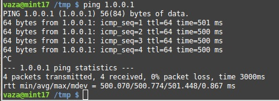
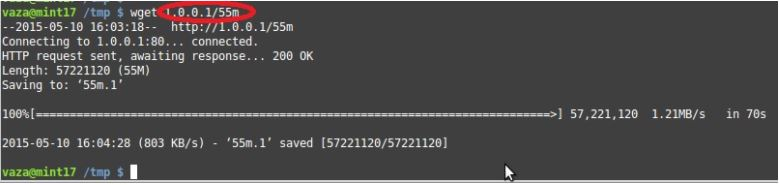
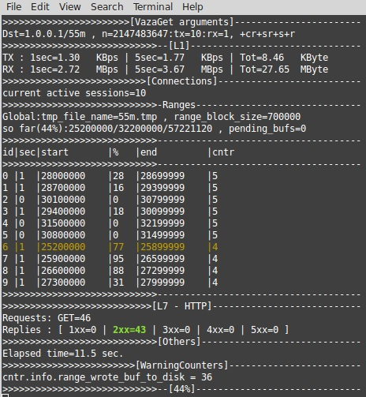
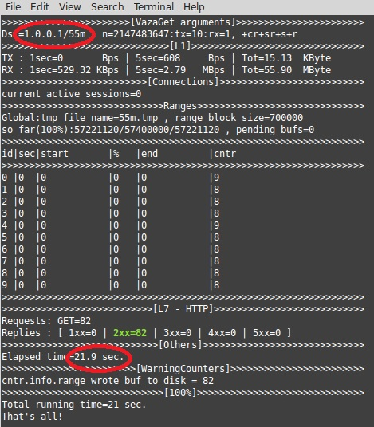
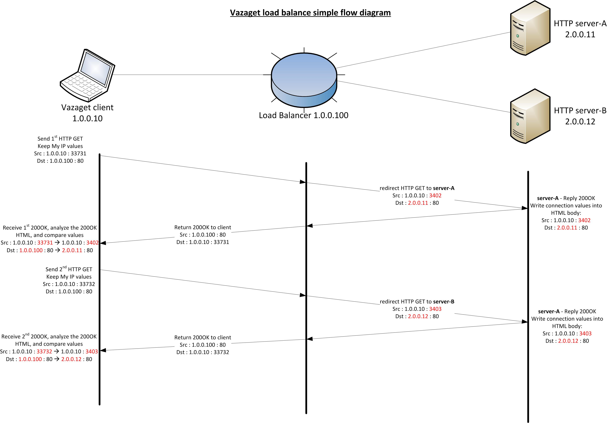
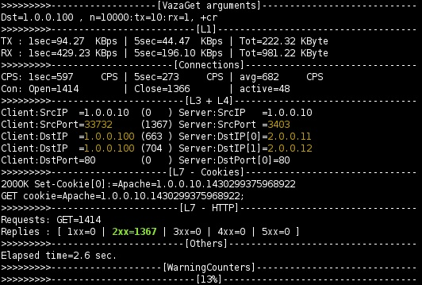

# vazaGet introduction

vazaGet is an HTTP/S CLI client application, written on Linux, with few special capabilities:
- **HTTP/S downloader** : special treat for big files, due to parallel downloading of different parts of the file.
- **Stress tester** : overload your web server with HTTP requests, and easily check the  load balancing between your web servers.

### Main features support :
- IPv4 
- IPv6
- HTTP/S chunks
- HTTP/S compression (gzip)
- HTTP/S POST
- HTTP/S cookies (few special scenarios for cookies)
- HTTP/S content-range
- QoS - BW throughput control (upload and download)
- Data sender - send and receive your own free data in packet.

### Main features 
1. **File download using "content range" (-r)** , simultaneously download different parts of file, can increase download time in 1/2 of normal download bit rate, especially on links with high delay.

see below example:

set delay of 500msec

	

download 55MB file via wget → 70 sec.

Download the same 55MB file, with the same delay (500msec) - see below capture of download in process - **10 simultaneous connections.**

**And finish downlaod the same 55m file with vazaGet (-r) in 21.9sec!!!**

2. **Stress tester** : overload your web server with HTTP requests, and easily check the load balancing between your web servers - see below diagram :

See below the display of your load balancing distribution:
**663** connections arrived to server **2.0.0.11**
**704** connections arrived to server **2.0.0.12**

 
## The full list of options (version 0.39r_x64)
    -ps <1-65535>	--> set source port (default=0)
    -n <1-2147483647>--> number of sessions (default=1)
	-br <1-1000000>	--> (Bytes Per Second) BW RX limit (default=0)
	-bt <1-1000000>	--> (Bytes Per Second) BW TX limit (default=0)
	-up <1-1300>	--> (Bytes) Post upload file (reuquires vazaget php (./vazaget -php) on the server) (default=0)
	-wn <1-1000000>	--> (sec)delay creation of new socket (default=0)
	-wg <1-1000000>	--> (sec)delay sending the GET request (default=0)
	-wc <1-1000000>	--> (sec)delay close socket (default=0)
	-o <string>	--> add note, it will be added to the log file (max_length=501)
	-pr <string>	--> send request to proxy (max_length=47)
	-ds <string>	--> (file name) send your own data from file (max_length=501)
	-ua <string>	--> change the default UA (user agent) (max_length=501)
	-gz		--> Add encoding-gzip to the GET (default=0)
	-fr		--> Close connection by RST, will activate automatic for over then 10K sessions. (default=0)
	-fs		--> Close connection by server, if overload, sockets last long time and may cause problems (default=0)
	-sr		--> Socket Reuse, each thread uses 1 socket, and resend GET's on it, auto change to 1 thread (default=0)
	-r		--> Support http header of Range, will download big files in few sim connections (default=0)
	-v		--> display version number (default=0)
	-h		--> help menu (default=0)
	-hds		--> help - data sender (default=0)
    SSL:
	-sv <0-2>	--> SSL:verify certificate common name, 0=none, 1=optional, 2=required (default=0)
	-sminv <0-3>	--> SSL:set minimum version, 0=ssl3, 1=tls1, 2=tls1_1, 3=tls1_2 (default=0)
	-smaxv <0-3>	--> SSL:set maximum version, 0=ssl3, 1=tls1, 2=tls1_1, 3=tls1_2 (default=3)
	-sd <0-4>	--> SSL:mbedtls debug flag (default=0)
	-scf <string>	--> SSL:force ciphers list: max 4 ciphers, separate by comma(,).
				get full cipher list using "-sc". e.g -scf 0xc02c,0xc030...  (max_length=100)
	-scaf <string>	--> SSL:The single file containing the top-level CA(s) you fully trust (max_length=501)
	-scap <string>	--> SSL:The path containing the top-level CA(s) you fully trust (max_length=501)
	-sc		--> SSL:print the supported ciphers (default=0)
    Cookies:
	-cc <string>	--> add your own cookie string to the HTTP GET request (max_length=1001)
	-cr		--> Cookie reuse from the last HTTP GET request (default=1)
	-cr2		--> send every 2nd GET with last cookie, and verify it arrived to destinated dst IP (default=0)
	-cw		--> Wait and hold all connections until receive cookie (default=0)

**Examples** (recommend load on your web server vazaget index.php (./vazaget -php)):
	./vazaget 192.168.1.1 -n 1000 --> 1000 IPv4 GET's
	./vazaget [2010::1]:8080  --> IPv6 GET over port 8080
	./vazaget http://your_site.com/your_path/your_file  --> GET to webaddress with path and file name
	./vazaget https://your_secured_site.com --> GET over SSL
	./vazaget http://your_site.com -pr http://www.your_proxy.com:3128 --> GET through proxy on port 3128
	./vazaget [2010::1] -up 1000 -bt 500 -br 400 --> POST of 1000 Bytes (require the vazaget php file "vazaget -php") 
			with BW TX limit to 500 Bps, and BW RX limit to 400 Bps

### Installation :
vazaGet is written in C, and compiled using GCC.
Download the sources, and run "make".

### Contact :
All rights reserved to Shay Vaza - shayvaza@gmail.com

